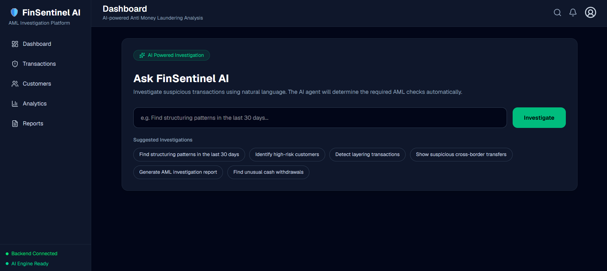

# 🛡️ FinSentinel AI

### Agentic AI-Powered Anti-Money Laundering Detection System


FinSentinel AI is an **Agentic AI-powered Anti-Money Laundering (AML) investigation platform** that combines **Machine Learning**, **behavioral feature engineering**, and **Large Language Models (LLMs)** to automatically detect suspicious financial activities and generate investigation-ready AML reports.

Instead of manually navigating dashboards, investigators interact with the system using natural language.

Example queries include:

- Find suspicious transactions
- Show suspicious cross-border transfers
- Identify high-risk customers
- Detect layering transactions
- Find structuring patterns in the last 30 days
- Generate AML investigation report

The AI agent automatically plans the investigation workflow, executes the required AML tools, and generates investigator-friendly explanations.

---

# Features

## Agentic AI Workflow

- Natural language AML investigations
- Gemini-powered workflow planner
- Automatic tool orchestration
- Investigation report generation
- Explainable AI outputs

---

## Machine Learning

- XGBoost AML detection model
- Risk probability prediction
- Transaction anomaly scoring
- Risk classification
- Fraud indicator generation

---

## Feature Engineering

### Transaction Features

- Cross-border transfers
- Currency conversion
- Cash deposits
- Cash withdrawals
- Self transfers
- ACH transactions
- Credit card payments
- Debit card payments
- Cheque transactions

### Behavioral Features

- Sender average transaction amount
- Transaction deviation ratio
- Rapid consecutive transactions
- Fan-In ratio
- Fan-Out ratio
- Historical transaction statistics
- Unique receivers
- Unique senders

---

## Investigation Tools

- Dataset profiling
- Feature engineering
- AML anomaly detection
- Risk scoring
- Explanation generation
- Investigation report generation

---

# Tech Stack

| Category         | Technologies                     |
| ---------------- | -------------------------------- |
| Backend          | FastAPI, Python                  |
| Machine Learning | XGBoost, Pandas, Joblib          |
| AI               | Google Gemini                    |
| Frontend         | React, Tailwind CSS              |
| Dataset          | IBM SAML-D Synthetic AML Dataset |

---

# Dataset

The project is trained using the **IBM SAML-D Synthetic AML Dataset**.

https://www.kaggle.com/datasets/berkanoztas/synthetic-transaction-monitoring-dataset-aml

---

# Project Structure

```text
backend/
│
├── src/
│   │
│   ├── agent/
│   │   ├── aml_agent.py
│   │   ├── llm_planner.py
│   │   ├── prompt.py
│   │   └── schemas.py
│   │
│   ├── api/
│   │   ├── main.py
│   │   ├── routes.py
│   │   └── schemas.py
│   │
│   ├── preprocessing/
│   ├── features/
│   ├── models/
│   ├── tools/
│   ├── train/
│   └── demo.py
│
├── requirements.txt
└── README.md
```

---

# System Architecture

```text
                 User Query
                      │
                      ▼
             Gemini Workflow Planner
                      │
                      ▼
              Execution Plan
                      │
        ┌─────────────┴─────────────┐
        ▼                           ▼
 Feature Engineering          Dataset Analysis
        │
        ▼
   XGBoost AML Model
        │
        ▼
 Risk Classification
        │
        ▼
 Explanation Generator
        │
        ▼
 Gemini Investigation Report
        │
        ▼
     React Dashboard
```

---

# Application Preview

## Dashboard

<p align="center">
  
</p>

---

## AI Investigation Workflow

<p align="center">
  
</p>

---

## Investigation Report

<p align="center">
  
</p>

---

# Getting Started

## 1. Clone the Repository

```bash
git clone https://github.com/Bhargav-Kulkarni84/aml_agent.git

cd aml_agent/backend
```

---

## 2. Create a Virtual Environment

### Windows

```bash
python -m venv .venv
```

Activate the environment.

### Git Bash

```bash
source .venv/Scripts/activate
```

### PowerShell

```powershell
.venv\Scripts\Activate.ps1
```

---

## 3. Install Dependencies

```bash
pip install -r requirements.txt
```

---

## 4. Configure Gemini API Key

Create:

```text
src/config.py
```

```python
GEMINI_API_KEY = "YOUR_GEMINI_API_KEY"
```

---

## 5. Train the AML Model

```bash
python -m src.train.train_model
```

The trained artifacts are stored inside:

```text
src/models/

├── aml_model.pkl
└── feature_columns.pkl
```

---

## 6. Run the Backend

```bash
uvicorn src.api.main:app --reload
```

Backend Server:

```
http://127.0.0.1:8000
```

---

# API Endpoints

| Method | Endpoint        | Description                  |
| ------ | --------------- | ---------------------------- |
| GET    | `/health`       | Health check                 |
| GET    | `/dashboard`    | Dashboard statistics         |
| GET    | `/transactions` | Transaction list             |
| GET    | `/customers`    | Customer analytics           |
| GET    | `/analytics`    | AML analytics                |
| POST   | `/investigate`  | AI-powered AML investigation |

---

# Example Request

```json
{
  "query": "Find suspicious transactions"
}
```

---

# Example Response

```json
{
  "intent": "SUSPICIOUS_TRANSACTIONS",
  "confidence": 0.99,
  "summary": {},
  "report": "Investigation report..."
}
```

---

# Roadmap

## Completed

- Agentic AI workflow
- LLM workflow planner
- AML feature engineering
- Behavioral profiling
- XGBoost AML detection model
- Risk classification
- Investigation report generation
- FastAPI backend
- React dashboard integration

## In Progress

- Structuring detection
- Layering detection
- High-risk customer detection
- Suspicious cash withdrawal detection
- Cross-border transaction investigation
- Dashboard enhancements
- Interactive AML visualizations

---

# Contributors

- **Bhargav Kulkarni**
- **Nikhil Bansal V**

---

# License

This project is licensed under the **MIT License**.

---

## Future Scope

- Real-time transaction monitoring
- Streaming fraud detection
- Graph-based money laundering detection
- Customer risk timeline
- Network visualization of suspicious transactions
- Multi-agent AML investigation
- SAR (Suspicious Activity Report) generation
- Case management integration
